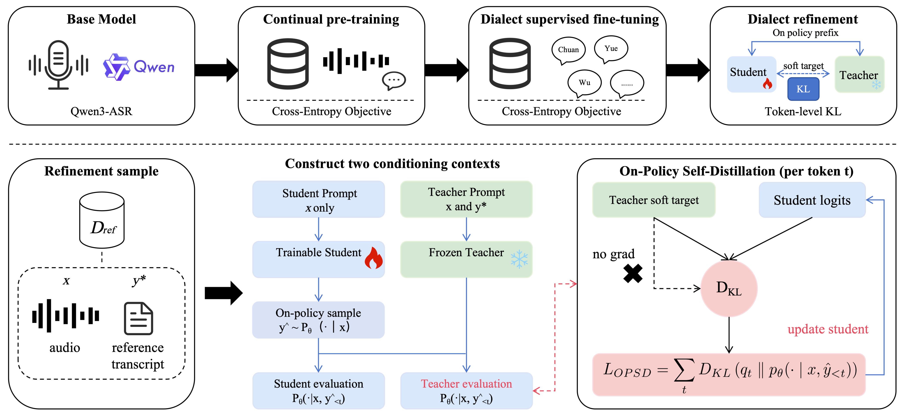
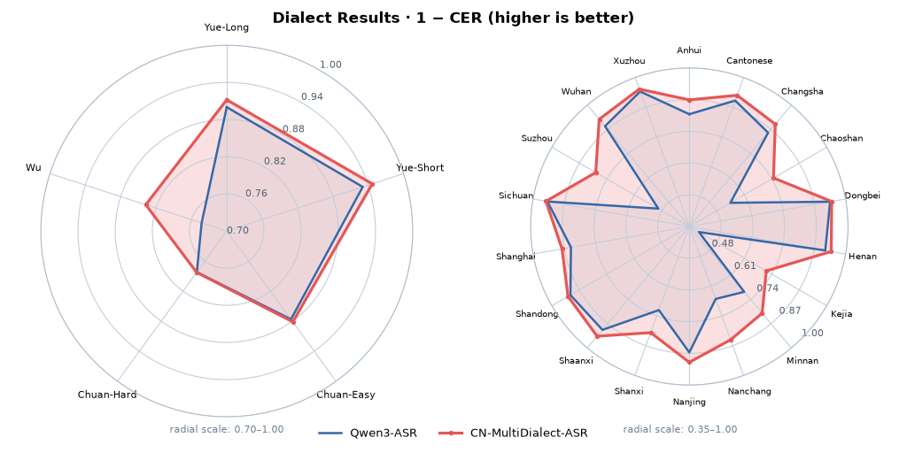

# On-Policy Self-Distillation for Multi-Dialect ASR: Mastering Dialects, Retaining Mandarin

> Official repository of the paper "On-Policy Self-Distillation for Multi-Dialect ASR: Mastering Dialects, Retaining Mandarin".

<div align="center">

[](#)
[](https://htmlpreview.github.io/?https://github.com/ASLP-lab/CN-MultiDialect-ASR/blob/main/demo/index.html)
[](https://huggingface.co/ASLP-lab/CN-MultiDialect-ASR/)
[](https://huggingface.co/ASLP-lab/CN-MultiDialect-ASR/)

</div>

<div align="center">
  
  <p><em>Overview of the staged adaptation pipeline. Top: base model, CPT, SFT, and OPSD. Bottom: OPSD with student on-policy prefixes, a frozen teacher conditioned on the reference transcript as privileged context, soft targets q<sub>t</sub>, and token-level KL.</em></p>
</div>

## Introduction

Large-scale ASR models such as Qwen3-ASR already achieve strong Mandarin recognition and have some ability to recognize Chinese dialects. In real-world speech, however, dialect recognition remains limited. Direct dialect fine-tuning can lower dialect CER, but it often raises Mandarin CER at the same time.

This repository studies how to adapt a capable ASR model for multi-dialect recognition without degrading Mandarin recognition. We adopt a three-stage adaptation pipeline:

1. **CPT**: continual pre-training on large-scale Mandarin-dialect speech to strengthen the Chinese ASR foundation.
2. **SFT**: dialect supervised fine-tuning with increased dialect sampling weight to lower dialect CER.
3. **OPSD**: On-Policy Self-Distillation as the final refinement objective.

OPSD addresses the train–test mismatch in autoregressive ASR by training the student on its own decoded prefixes, while a frozen teacher, conditioned on the reference transcript as privileged context, provides soft token-level targets. Under matched refinement data and schedule, OPSD improves dialect recognition without raising Mandarin CER, whereas continued teacher-forced fine-tuning increases Mandarin CER.

We instantiate the framework with Qwen3-ASR-1.7B and evaluate it on public and internal Mandarin and dialect test sets. Model weights are available at [ASLP-lab/CN-MultiDialect-ASR](https://huggingface.co/ASLP-lab/CN-MultiDialect-ASR/).

## Key Features

* **Mandarin–dialect balanced adaptation**: improves Chinese dialect ASR while retaining Mandarin recognition.
* **Three-stage pipeline**: CPT strengthens the Chinese ASR foundation, dialect SFT specializes for dialects, and OPSD refines the final checkpoint.
* **On-Policy Self-Distillation**: trains on student-decoded prefixes with soft teacher targets, reducing the train–test mismatch of teacher-forced ASR training.

## Demo

**[Watch Online](https://htmlpreview.github.io/?https://github.com/ASLP-lab/CN-MultiDialect-ASR/blob/main/demo/index.html)**

Video demo with live waveforms and model transcriptions for Cantonese, Minnan, Sichuan, and Wu.


## Quickstart

Inference is compatible with [Qwen3-ASR](https://github.com/QwenLM/Qwen3-ASR). We recommend installing the official `qwen-asr` package in a clean environment.

### Environment Setup

```bash
conda create -n qwen3-asr python=3.12 -y
conda activate qwen3-asr
pip install -U qwen-asr
```

For faster inference with the vLLM backend:

```bash
pip install -U qwen-asr[vllm]
```

### Model Download

You can load the model directly from Hugging Face, or download it locally first:

```bash
# Hugging Face
pip install -U "huggingface_hub[cli]"
huggingface-cli download ASLP-lab/CN-MultiDialect-ASR --local-dir ./CN-MultiDialect-ASR

# ModelScope (recommended for users in Mainland China)
pip install -U modelscope
modelscope download --model ASLP-lab/CN-MultiDialect-ASR --local_dir ./CN-MultiDialect-ASR
```

Model card: [https://huggingface.co/ASLP-lab/CN-MultiDialect-ASR/](https://huggingface.co/ASLP-lab/CN-MultiDialect-ASR/)

### Python Inference

The usage is the same as Qwen3-ASR. Load the model with `Qwen3ASRModel.from_pretrained` and call `transcribe`:

```python
import torch
from qwen_asr import Qwen3ASRModel

model = Qwen3ASRModel.from_pretrained(
    "ASLP-lab/CN-MultiDialect-ASR",  # or "./CN-MultiDialect-ASR" for a local path
    dtype=torch.bfloat16,
    device_map="cuda:0",
    # attn_implementation="flash_attention_2",
    max_inference_batch_size=32,
    max_new_tokens=256,
)

results = model.transcribe(
    audio="path/to/audio.wav",
    language="Chinese",  # or None for automatic language detection
)

print(results[0].language)
print(results[0].text)
```

Batch inference is also supported:

```python
results = model.transcribe(
    audio=[
        "path/to/mandarin.wav",
        "path/to/dialect.wav",
    ],
    language=["Chinese", "Chinese"],
)

for r in results:
    print(r.language, r.text)
```

For more advanced usage, including vLLM backend, streaming inference, and forced alignment, please refer to the [Qwen3-ASR repository](https://github.com/QwenLM/Qwen3-ASR).

## Method Overview

| Stage  | Training data                                                                | Goal                                                 | Objective      |
| ------ | ---------------------------------------------------------------------------- | ---------------------------------------------------- | -------------- |
| `CPT`  | Full Mandarin-dialect collection (`~100k` hours)                             | Build a stronger Chinese ASR foundation              | Cross-entropy  |
| `SFT`  | Same sources with higher dialect sampling weight and a small Mandarin anchor | Lower dialect CER                                    | Cross-entropy  |
| `OPSD` | Dialect refinement subset (`~5k` hours)                                      | Improve dialect recognition without hurting Mandarin | Token-level KL |

### Stage 1: CPT

Starting from Qwen3-ASR-1.7B, we continually pre-train on a large Mandarin-dialect corpus that combines public Mandarin corpora, public dialect corpora, and internal Chinese speech. This stage strengthens the overall ASR foundation before dialect-focused adaptation.

### Stage 2: SFT

Dialect SFT keeps the same training sources but changes the Mandarin-dialect sampling ratio. All dialect training data are retained, while only a small amount of Mandarin data is kept as an anchor. This stage improves dialect CER, but it can still raise Mandarin CER.

### Stage 3: OPSD

We apply OPSD to the SFT checkpoint as the final refinement objective.

1. The student samples its own hypothesis from the input speech with training temperature `tau = 0.8`.
2. A frozen teacher, initialized from the same SFT checkpoint, sees the reference transcript as privileged context and predicts soft token targets on the student prefixes.
3. The student is updated by matching the teacher distribution with token-level KL divergence.

At inference time, only the student pathway is used. Unlike continued teacher-forced fine-tuning, OPSD trains under decoding states closer to inference and avoids another hard one-hot update on dialect data.

## Experimental Setup

### Evaluation Sets

We evaluate on three groups of test sets:

#### Mandarin test sets

`AISHELL-1`, `AISHELL-2`, `KeSpeech`, `SpeechIO-1`, `SpeechIO-2`, `SpeechIO-3`, `WenetSpeech Test_Meeting`, `WenetSpeech Test_Net`

#### Public dialect test sets

`WenetSpeech-Yue Long`, `WenetSpeech-Yue Short`, `WenetSpeech-Chuan Easy`, `WenetSpeech-Chuan Hard`, `WenetSpeech-Wu`

#### Internal dialect test sets

`Anhui`, `Cantonese`, `Changsha`, `Chaoshan`, `Dongbei`, `Henan`, `Kejia`, `Minnan`, `Nanchang`, `Nanjing`, `Shanxi`, `Shaanxi`, `Shandong`, `Shanghai`, `Sichuan`, `Suzhou`, `Wuhan`, `Xuzhou`

## Main Results

### Dialect Results (1 − CER)

<div align="center">
  
  <p><em>Higher is better. Left: 5 public dialect sets; right: 18 internal dialects. Each panel uses its own radial scale. <strong>CN-MultiDialect-ASR</strong> is the released OPSD checkpoint.</em></p>
</div>

### Mandarin CER (%)

| Evaluation set | Qwen3-ASR | CN-MultiDialect-ASR |
| -------------- | --------- | ------------------- |
| AISHELL-1      | 1.57      | **1.38**            |
| AISHELL-2      | 2.79      | **2.52**            |
| KeSpeech       | 5.11      | **4.56**            |
| SpeechIO-1     | **0.75**  | 0.86                |
| SpeechIO-2     | 3.83      | **3.39**            |
| SpeechIO-3     | 1.39      | **1.27**            |
| Test_Meeting   | **6.74**  | 6.85                |
| Test_Net       | 5.46      | **5.30**            |
| Mandarin Avg.  | 3.46      | **3.27**            |

## Citation

If you use this work, please consider citing:

```bibtex
@article{opsd2026,
  title={On-Policy Self-Distillation for Multi-Dialect ASR: Mastering Dialects, Retaining Mandarin},
  author={Anonymous Authors},
  journal={Anonymous submission},
  year={2026}
}
```

## License

The released model is licensed under [Apache 2.0](https://huggingface.co/ASLP-lab/CN-MultiDialect-ASR/).
